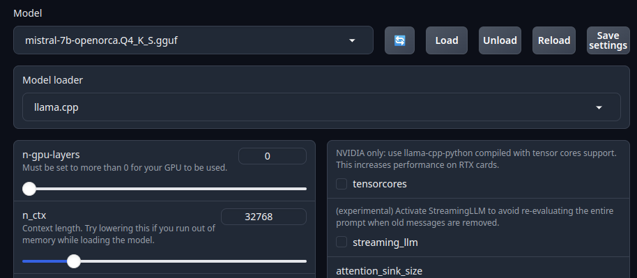
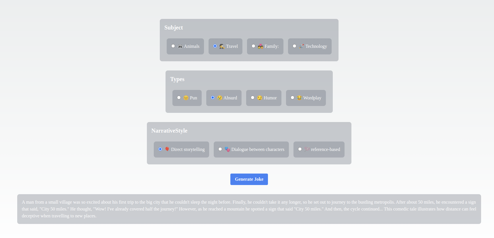

# FunnyAI App

Welcome to FunnyAI App, your go-to platform for generating hilarious jokes and witty content using the power of artificial intelligence!


## Options

- **Subject:** Animals, Travel, Family, Technology
- **Types:** Pun, Absurd, Humor, Wordplay
- **Narrative Style:** Direct storytelling, Dialogue between characters, Reference-based

## Dependencies

- [AI](https://www.npmjs.com/package/ai): Library for AI-related functionalities
- [OpenAI](https://www.npmjs.com/package/openai): Library for accessing OpenAI API
- [Text generation web UI](https://github.com/oobabooga/text-generation-webui?tab=readme-ov-file#how-to-install): A Gradio web UI for Large Language Models.

## Text generation web UI Installation Steps

1. Clone the repository from GitHub:

   ```bash
   git clone https://github.com/oobabooga/text-generation-webui.git
   ```

2. Change to the `text-generation-webui` directory:

   ```bash
   cd text-generation-webui
   ```

3. Run the installation script:

   * Use `start_linux.sh` script for Linux

   ```bash
   ./start_linux.sh
   ```

4. Wait for the download and installation of dependencies to finish

5. When prompted, select your GPU manufacturer and model

6. Confirm selection and wait until the entire installation process finishes

7. Open your browser and go to <http://localhost:7860> to test if the application is working

8. You can use this same script to start the application in the future


## Getting Started

To get started with FunnyAI App:

1. Clone the repository to your local machine.
2. Install the necessary dependencies using ``` npm install ```
3. ``` npm install ai openai ```
4. ``` npm run dev ``` 
5. ```./start_linux.sh --model-dir /text-generation-webui/models --api ```
6. Select models ``` mistral-7b-v0.1.Q4_0.gguf ``` 
7. Explore the different options for joke generation and customization.

Open [http://localhost:3000](http://localhost:3000) with your browser to see the result.

## Result 






## Learn More

To learn more about Next.js, take a look at the following resources:

- [Next.js Documentation](https://nextjs.org/docs) - learn about Next.js features and API.
- [Learn Next.js](https://nextjs.org/learn) - an interactive Next.js tutorial.

You can check out [the Next.js GitHub repository](https://github.com/vercel/next.js/) - your feedback and contributions are welcome!

